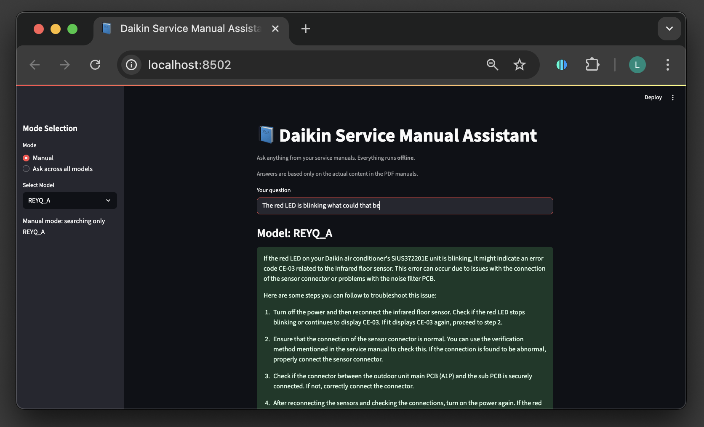

# 📘 Daikin Service Manual Assistant

A local, offline, privacy-respecting Q&A app to help **Daikin air conditioner service technicians in India** understand and troubleshoot equipment using natural language.



---

## 🎯 Purpose

This assistant was built specifically for **Daikin AC service workers in India**, many of whom may not be highly literate or technically trained. The goal is to:

- 💬 Allow asking questions in simple natural language (voice planned)
- 🔊 Enable reading answers aloud (planned)
- 🧠 Provide accurate, page-specific answers from Daikin service manuals
- 🇮🇳 Run fully **offline and locally**, with no internet required

> ✅ *Voice input and output are planned but **not implemented yet.***

---

## 🚀 Features

- Ask natural-language questions about Daikin AC manuals
- Semantic search using FAISS vector store
- Get answers along with **page number** and **manual file name**
- Smart chunking and embedding of PDF pages
- Clean and simple Streamlit UI
- 100% offline — privacy-respecting and fast

---

## ✅ Requirements

- Python 3.10+
- [Ollama](https://ollama.ai) (for local LLM like `mistral`)
- Optional: `conda` (to avoid MKL issues)
- *Planned voice features will need `speechrecognition` and `pyttsx3` or `gTTS`*

---

## 🔧 Setup Instructions

### Install dependencies

```bash
pip install -r requirements.txt
```

### Start Ollama and download your model

```bash
ollama run mistral
```

---

## 📄 Add Your Manuals

Place your PDF service manuals inside the `manuals/` folder:

```
manuals/
├── daikin_split_ac_manual.pdf
├── troubleshooting_guide.pdf
└── error_codes.pdf
```

---

## 🧠 Build the Vector Index

Before running the app, build the FAISS index (run this only when adding new PDFs):

```bash
python build_index.py
```

---

## 💬 Launch the Assistant

Start the app with:

```bash
Streamlit run app.py
```

---

## How to Use

- Type a question like:

```
Why is the red light blinking on the outdoor unit?
```

- You'll receive:
  - A helpful answer
  - The page number where it was found
  - The PDF file name

---

## 🔉 Voice Support (Planned Feature)

We aim to add **voice input and text-to-speech output** in a future version:

- 🎙️ Mic input via `speechrecognition`
- 🗣️ Text-to-speech via `pyttsx3` or `gTTS`
- 🈯 Support for Indian languages like Hindi, Tamil, Bengali, etc.

> These features are **not included yet**, but the system is designed with them in mind.

---

## 🛠️ Optional Improvements

- Add voice support (planned)
- Collapsible document source preview
- PDF viewer integration
- Mobile-friendly interface
- Docker container for easy deployment

---

## 🧪 Tech Stack

| Component    | Technology                     |
| ------------ | ------------------------------ |
| Embeddings   | sentence-transformers (MiniLM) |
| Vector Store | FAISS                          |
| PDF Loader   | PyMuPDFLoader (LangChain)      |
| Chunking     | LangChain Recursive Splitter   |
| LLM          | Ollama (e.g., mistral)         |
| UI           | Streamlit                      |

---

## 🤝 Acknowledgments

- [LangChain](https://www.langchain.com/)
- [Hugging Face](https://huggingface.co/)
- [Ollama](https://ollama.ai/)
- [Streamlit](https://streamlit.io/)
- Daikin technicians who inspired this project 💙
